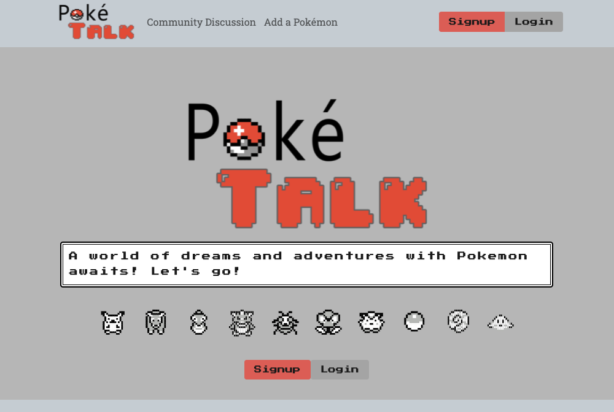

# Poké Talk

## Description
- Poké Talk is a MERN application for the Pokémon trainers to connect with other trainers and discuss their Pokémon.

## Installation
- To install this application, start by cloning the repo to your local device. Run ```npm init```. Run ```npm install``` to install all dependencies. Run ```node seeds/seedpoke.js``` to populate tables within the database. Run ```npm run develop``` to start the server up and launch the page. 
- The live Heroku app can be viewed: [here](https://ancient-fjord-95576.herokuapp.com/)

## Usage
- To use this application you will need to login to the deployed site on Heroku, creating a username and password with your email. You will be able to place Pokémon up to be discussed by other trainers. All Pokémon that you put up for discussion will be shown under your profile page where you can open the comments or remove the Pokémon from discussion. You will also be able to edit your username and email under your profile page if you click the ```Update Info``` button.

## Screenshot



## Contributors
- Daniel Mosso
	- [GitHub](https://github.com/benjimosso)
	- [Email](benjimosso@gmail.com)
- Haley Parish
	- [GitHub](https://github.com/heparish)
	- [Email](heparish@ucdavis.edu)
- Adrian Aguilar
	- [GitHub](https://github.com/Ascension23)
	- [Email](Tygor23@gmail.com)

## Credits
- [Apollo](https://www.apollographql.com/)
- [GraphQL](https://graphql.org/)
- [Semantic UI React](https://react.semantic-ui.com/)